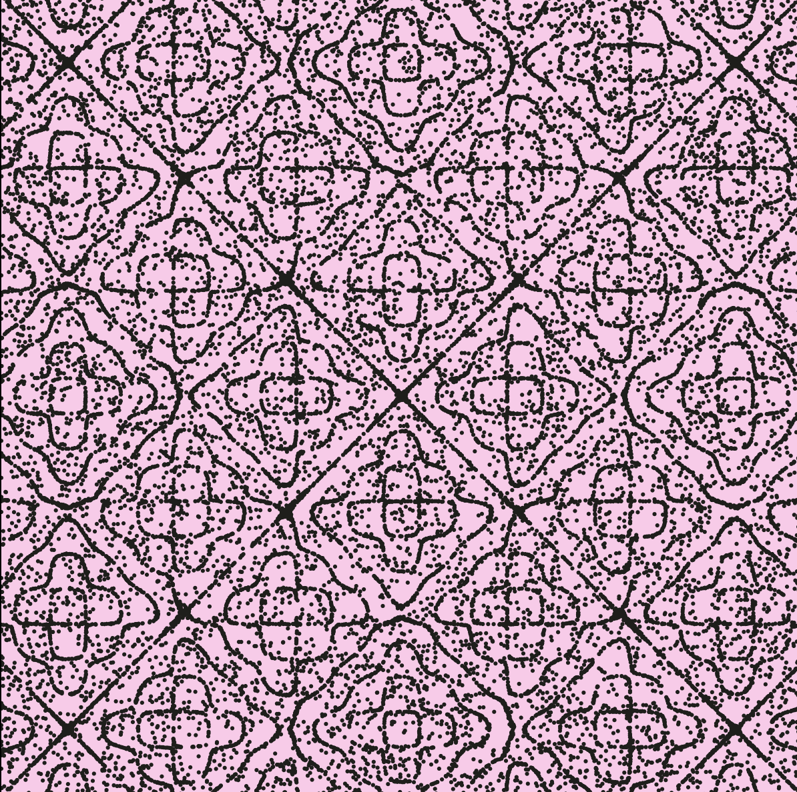
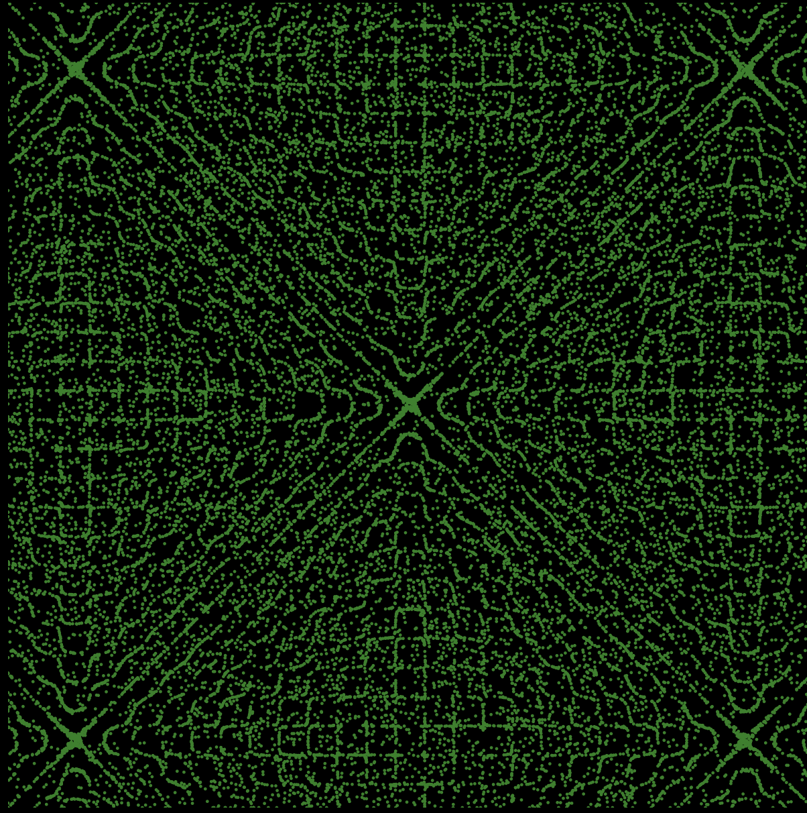

# VARIATION JAM - MUSIC VISUALIZER ALGORITHM 

SKYLA TROUSDALE 

[View this project online](https://browneyegirl.github.io/cart253/variation-jam/)

## Description

> *VARIATION JAM - MUSIC VISUALIZER ALGORITHM* simulates Chladni sand patterns and synchs them up with the frequencies of a song. The size, colour, and arrangement of the sand is determined by the frequencies picked up by an FFT frequency analyzer making this algorithm universal and not limited to the songs I've provided
> Click play song 1, 2, or 3 to stop/start the program. 
> LOOKING FORWARD: I am working on developing an algorithm that takes desktop audio input using other javascript libraries so I can display it in my house. I will keep updating it. 

## Screenshot(s)

## Attribution

> - This project uses [p5.js](https://p5js.org).
> - This project uses sound files by Aphex Twin on SoundCloud
> - This project references the overall concept of these educational videos/articles on chladni patterns: 
> - https://www.youtube.com/watch?v=CR_XL192wXw 
> - https://youtu.be/J-siGcsK2k8
> - https://www.dynamicmath.xyz/chladni-patterns/
> - https://paulbourke.net/geometry/chladni/
> - This project was debugged with graphing math taught by this p5 tutorial: https://www.youtube.com/watch?v=nqx_joZFLDI
> - This project uses code taught by this p5 particle tutorial: https://www.youtube.com/watch?v=QlpadcXok8U

## License

> This project is licensed under a Creative Commons Attribution ([CC BY 4.0](https://creativecommons.org/licenses/by/4.0/deed.en)) license with the exception of libraries and other components with their own licenses.